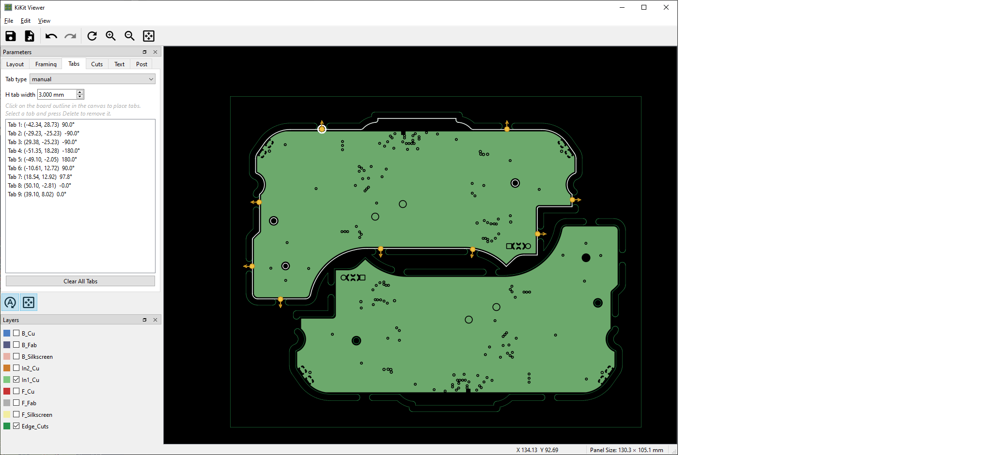

# KiKit Viewer

A visual panel editor for [KiKit](https://github.com/yaqwsx/KiKit) that runs as a KiCad pcbnew plugin. Design and preview PCB panels interactively without editing JSON by hand.



## Features

- **Live preview** — Panel re-renders automatically as you adjust parameters (or manually via F5).  Live refresh can be enabled or disabled with a click.
- **Layout** — Supports grid layout with rows, columns, spacing, rotation, and alternation as well as a manual placement mode with drag-and-drop positioning.
- **Tabs** — Supports standard KiKit modes (fixed, spacing, corner, full, annotation) as well as manual tab placement. Manual mode lets you drag tab markers onto board edges.
- **Framing** — Supports KiKit standard modes: frame, tight frame, rails (top/bottom or left/right); Fiducials and tooling holes have draggable handles for positioning them graphically.
- **Layer visibility** — Per-layer toggle with color swatches matching the active KiCad color theme.
- **Undo/Redo** — full undo stack (Ctrl+Z / Ctrl+Y)
- **Save/Load** — `.kicad_panel` format (JSON); legacy `.kikit.json` files load cleanly
- **Export** — copies the finished panel as a standard KiCad PCB file (`*.kicad_pcb`) to a location of your choice

## Requirements

- **KiCad 8.0** or later
- **KiKit plugin** installed via KiCad's Plugin Content Manager (PCM)
- **Python 3.11+** (separate from KiCad's embedded Python)
- The following Python packages installed in your external Python environment:

```
pip install PySide6>=6.6 shapely>=2.0 qtawesome>=1.3
```

## Installation

### Via KiCad Plugin Content Manager (recommended)

> PCM submission pending. In the meantime, use the manual method below.
>
> **Note:** The KiKit plugin (a separate PCM package) must be installed first regardless of which installation method you use.

### Manual installation

1. Install the **KiKit plugin** by following the directions at https://yaqwsx.github.io/KiKit/latest/installation/intro/, then restart KiCad.
2. Clone or download this repository.
3. Run the install script. It writes a small stub into KiCad's scripting/plugins folder that points back to the cloned source.

   ```
   python install_plugin.py
   ```

   The script auto-detects all installed KiCad versions and targets the newest one. To see what was found, or to target a specific version:

   ```
   python install_plugin.py --list
   python install_plugin.py 9.0
   ```

   Works on Windows, macOS, and Linux.

4. Restart KiCad. A **KiKit Viewer** button will appear in the pcbnew toolbar.

## Usage

1. Open a board in pcbnew.
2. Click the **KiKit Viewer** toolbar button. The viewer opens in a separate window with the current board pre-loaded.
3. Adjust panelization parameters in the left dock (Layout, Tabs, Framing, Cuts, Post).
4. The panel preview updates automatically. Use **F5** or the Refresh button to trigger a manual update.
5. **Save** your configuration as a `.kicad_panel` file (File → Save, Ctrl+S).
6. **Export** the finished panel board (File → Export).

### Keyboard shortcuts

| Key | Action |
|-----|--------|
| F5 | Refresh panel |
| Ctrl+0 / Home | Fit panel in view |
| Ctrl++ / Ctrl+- | Zoom in / out |
| Ctrl+Z / Ctrl+Y | Undo / Redo |
| Ctrl+S | Save |
| Delete | Remove selected tab marker (manual tabs mode) |

### Manual board placement

Switch the **Layout** panel to type **manual**, then:
- Click a row in the position table to select a board, or click a board outline on the canvas to select its table row — a white outline appears on the canvas
- Drag the outline to reposition the board
- The table can be manually edited to change position and rotation.  Simply double-click any parameter to edit. 

### Manual tab placement

Switch the **Tabs** panel to type **manual**, then:
- **Left-click** on the canvas to place a tab on the nearest board edge
- **Right-click** on the canvas → **Add Tab Here**
- Drag tab markers to reposition them (they snap to the board outline on release)
- Right-click a marker → **Remove**, or select it and press **Delete**

## File format

KiKit Viewer saves configurations as `.kicad_panel` files — standard KiKit JSON with an extra `kikit_viewer` section for UI state (layer visibility, etc.). The KiKit section is identical to a `.kikit.json` preset file and can be used directly with the KiKit CLI:

```
kikit panelize --preset my_panel.kicad_panel board.kicad_pcb panel.kicad_pcb
```

## License

MIT — see [LICENSE](LICENSE).

## AI Notice
Claude Code was used in the creation of this plugin.  OpenAI (ChatGPT) was used to create the plugin icon.
